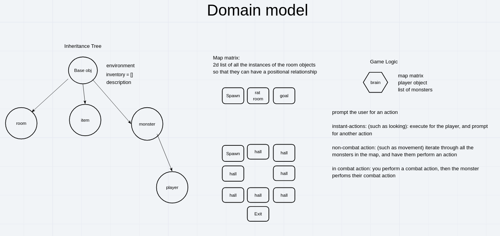

# [Text-Based Wireframe](https://docs.google.com/document/d/1LKfCth50D_ZHGRhX65oYNPrHe_puC8IV2xHlsAom86A/edit)
- provides an abstract view of how the objects within the game can interact with each other. 

# [User Stories](https://trello.com/b/slsuNprw/code-crusade)
- We used a Trello board to organize tasks and To Do's while building this game. 

# Domain Model

- Our team created this Domain Model to visualize the connections between the different objects in the game...

# ASCII art
rat, guard, door, ASCII art from www.asciiart.eu

torch by Mark Bell

key by Seth Mcfeeters

